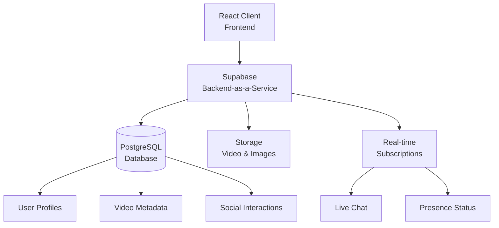

# Toptop (TikTok Clone)

<p>
  
  
</p>

<p>
  <a href="https://react.dev/"></a>
  <a href="https://tailwindcss.com/"></a>
  <a href="https://supabase.com/"></a>
  <a href="https://postgresql.org/"></a>
  <a href="https://github.com/features/copilot"></a>
  <a href="LICENSE"></a>
</p>

## 🗺️ Navigation

- [Overview](#-overview)
- [Goals & Key Features](#-goals--key-features)
- [Project Structure](#-project-structure)
- [System Requirements](#-system-requirements)
- [Quick Start](#-quick-start)
- [Tech Stack](#-tech-stack)
- [Core Features](#-core-features)
- [Production Deployment](#-production-deployment)
- [Developer](#-developer)
- [Aim Towards](#-aim-towards)

## 👁️ Overview

🎯 **A modern TikTok clone built with React & Supabase -** A comprehensive social media platform that replicates TikTok's core features including video streaming, user authentication, social interactions, real-time messaging, and content discovery.

## 🏆 Goals & Key Features

<table>
  <tr>
    <td align="center" width="100%">
      <h3>🎥 Video Streaming</h3>
      <p>Smooth video playback with adaptive quality and infinite scroll</p>
    </td>
  </tr>
  <tr>
    <td align="center" width="100%">
      <h3>⚡ Real-time Interactions</h3>
      <p>Live likes, comments, follows with instant UI updates</p>
    </td>
  </tr>
  <tr>
    <td align="center" width="100%">
      <h3>💬 Live Messaging</h3>
      <p>Real-time chat with media sharing and read receipts</p>
    </td>
  </tr>
  <tr>
    <td align="center" width="100%">
      <h3>🖥️ Desktop-Focused Design</h3>
      <p>Optimized desktop experience with clean, modern UI</p>
    </td>
  </tr>
</table>

### 🚀 Key Capabilities

- **🎥 Video Upload & Streaming**: Upload videos with custom thumbnails and descriptions
- **👥 Social Features**: Follow/unfollow users, like videos, save content
- **💬 Real-time Messaging**: Chat with media sharing, typing indicators, and presence status
- **🔍 Content Discovery**: For You page algorithm and Following feed
- **🖥️ Desktop Experience**: Clean desktop interface with sidebar navigation
- **🔐 Secure Authentication**: Supabase Auth with email/password and social login
- **⚙️ User Settings**: Profile management, privacy controls, and preferences

## 🌳 Project Structure

```
tiktok-clone/
├── 📁 public/                   # Static assets (index.html, images)
│
├── 📁 src/                      # Source Code
│   ├── 📁 assets/               # Fonts, icons, and other static resources
│   ├── 📁 components/           # Reusable UI components (e.g., Button, LoginForm)
│   ├── 📁 config/               # Application configuration (routes, Supabase client)
│   ├── 📁 contexts/             # React Context providers for global state
│   ├── 📁 hooks/                # Custom React hooks (e.g., useVideoData)
│   ├── 📁 layouts/              # Page layout components (e.g., DefaultLayout)
│   ├── 📁 pages/                # Main application pages (e.g., Home, Profile)
│   └── 📁 services/             # API integration layer
│
├── 📄 .env.example              # Environment variable template
├── 📄 docker-compose.dev.yml    # Development container setup
├── 📄 package.json              # Dependencies & scripts
└── 📄 tailwind.config.js        # Tailwind CSS configuration
```

### 📊 Data Flow Architecture

<div align="center">



</div>

## ⚙️ System Requirements

| Component             | Version    | Notes                          |
| --------------------- | ---------- | ------------------------------ |
| **Node.js**           | ≥ 18.0.0   | Required for React development |
| **npm/yarn**          | Latest     | Package manager                |
| **Supabase Account**  | Free Tier+ | Backend services & database    |
| **Modern Browser**    | Latest     | Chrome, Firefox, Safari, Edge  |
| **Docker** (Optional) | Latest     | For containerized development  |

## 🏃 Quick Start

### ⚡ One-Command Setup

```bash
git clone https://github.com/mrthinh307/tiktok-clone.git
cd tiktok-ui-supabase
npm install && npm start
```

### 📊 Detailed Setup

#### 1. 📥 Clone Repository

```bash
git clone https://github.com/mrthinh307/tiktok-clone.git
cd tiktok-ui-supabase
```

#### 2. 📦 Install Dependencies

```bash
npm install
# or
yarn install
```

#### 3. 🔧 Environment Setup

```bash
# Create environment file
cp .env.example .env

# Add your Supabase credentials
REACT_APP_SUPABASE_URL=your_supabase_url
REACT_APP_SUPABASE_KEY=your_supabase_anon_key
```

#### 4. 🗄️ Supabase Setup

1. Create a new project at [supabase.com](https://supabase.com)
2. Set up authentication providers
3. Create necessary database tables (SQL schema available in docs)
4. Configure storage buckets for videos and images

#### 5. ▶️ Run Development Server

```bash
npm start
# or
yarn start
```

📍 **Application**: `http://localhost:3000`

#### 6. 🐳 Docker Development (Optional)

```bash
# Start with Docker Compose
docker-compose -f docker-compose.dev.yml up --build
```

## 🛠️ Tech Stack

### 🖥️ Frontend

| Technology           | Purpose     | Details                               |
| -------------------- | ----------- | ------------------------------------- |
| **React 19**         | Framework   | Latest React with concurrent features |
| **React Router DOM** | Routing     | Client-side navigation                |
| **Tailwind CSS**     | Styling     | Utility-first CSS framework           |
| **Framer Motion**    | Animations  | Smooth animations & transitions       |
| **FontAwesome**      | Icons       | Comprehensive icon library            |
| **Tippy.js**         | Tooltips    | Interactive tooltip components        |
| **Axios**            | HTTP Client | API request handling                  |

### 🗄️ Backend & Database

| Technology             | Purpose              | Details                           |
| ---------------------- | -------------------- | --------------------------------- |
| **Supabase**           | Backend-as-a-Service | Authentication, database, storage |
| **PostgreSQL**         | Database             | Relational database via Supabase  |
| **Supabase Storage**   | File Storage         | Video and image hosting           |
| **Supabase Real-time** | Live Updates         | Real-time subscriptions           |
| **Row Level Security** | Security             | Database-level authorization      |

### 🎨 UI & Styling

| Technology              | Purpose      | Details                   |
| ----------------------- | ------------ | ------------------------- |
| **Custom TikTok Fonts** | Typography   | Authentic TikTok design   |
| **SCSS Modules**        | Styling      | Component-scoped styles   |
| **Desktop-First Design** | UI Layout    | Optimized for desktop use |
| **Custom Animations**   | UX           | Smooth micro-interactions |

### 🔧 Development Tools

| Technology                | Purpose          | Details                   |
| ------------------------- | ---------------- | ------------------------- |
| **Create React App**      | Build Tool       | Development & build setup |
| **React App Rewired**     | Configuration    | Webpack customization     |
| **Babel Module Resolver** | Imports          | Absolute import paths     |
| **Docker**                | Containerization | Development environment   |
| **ESLint**                | Code Quality     | JavaScript/React linting  |

## 🗝️ Core Features

### 🖥️ User Interface

<table>
  <tr>
    <td width="50%">
      <h4>🏠 Home Feed</h4>
      <ul>
        <li>For You algorithm-based content</li>
        <li>Following feed for subscribed users</li>
        <li>Infinite scroll with preloading</li>
        <li>Video autoplay with sound control</li>
        <li>Video autoscroll mode</li>
        <li>Keyboard navigation (↑/↓ arrows)</li>
      </ul>
    </td>
    <td width="50%">
      <h4>👤 User Profiles</h4>
      <ul>
        <li>Customizable profile information</li>
        <li>Video portfolio with tabs (Videos, Liked, Reposts)</li>
        <li>Follower/Following lists</li>
        <li>Social sharing options</li>
        <li>Profile editing capabilities</li>
      </ul>
    </td>
  </tr>
</table>

### 🎥 Video Features

<table>
  <tr>
    <td width="50%">
      <h4>📤 Upload System</h4>
      <ul>
        <li>Drag & drop video upload</li>
        <li>Custom thumbnail generation</li>
        <li>Description with hashtags & mentions</li>
        <li>Progress tracking</li>
        <li>Video preview before publishing</li>
      </ul>
    </td>
    <td width="50%">
      <h4>▶️ Video Player</h4>
      <ul>
        <li>Adaptive video quality</li>
        <li>Smooth playback controls</li>
        <li>Volume control with persistence</li>
        <li>Fullscreen support</li>
        <li>Loading state management</li>
      </ul>
    </td>
  </tr>
</table>

### 👥 Social Features

<table width="100%">
  <tr width="100%">
    <td width="50%">
      <h4>👍 Interactions</h4>
      <ul>
        <li>Like/Unlike videos with animation</li>
        <li>Follow/Unfollow users</li>
        <li>Save videos to favorites</li>
        <li>Share videos (social platforms)</li>
        <li>Comment system</li>
      </ul>
    </td>
    <td width="50%">
      <h4>💬 Real-time Messaging</h4>
      <ul>
        <li>1-on-1 chat conversations</li>
        <li>Media sharing (images, videos)</li>
        <li>Read receipts</li>
        <li>Typing indicators</li>
        <li>Online presence status</li>
      </ul>
    </td>
  </tr>
</table>

### 🔐 Authentication & Security

- **Supabase Auth**: Email/password registration and login
- **Protected Routes**: Authenticated-only areas
- **Row Level Security**: Database-level permissions
- **Session Management**: Automatic token refresh
- **Password Reset**: Email-based password recovery

## 🔬 Production Deployment

### 🌐 Frontend Deployment

```bash
# Build for production
npm run build

# Serve build files
npx serve -s build -l 3000
```

### ☁️ Recommended Hosting

| Platform             | Best For        | Setup                    |
| -------------------- | --------------- | ------------------------ |
| **Vercel**           | React Apps      | `vercel --prod`          |
| **Netlify**          | Static Sites    | Drag & drop build folder |
| **Firebase Hosting** | Google Stack    | `firebase deploy`        |
| **AWS Amplify**      | AWS Integration | Connect GitHub repo      |

### 🐳 Docker Production

```bash
# Build production image
docker build -f Dockerfile.prod -t tiktok-clone .

# Run production container
docker run -p 80:80 --env-file .env tiktok-clone
```

### 🔧 Environment Variables

```bash
# Production environment
REACT_APP_SUPABASE_URL=your_production_supabase_url
REACT_APP_SUPABASE_KEY=your_production_anon_key
REACT_APP_ENVIRONMENT=production
```

### 📊 Performance Optimization

- **Code Splitting**: Automatic route-based splitting
- **Image Optimization**: WebP format with fallbacks
- **Caching Strategy**: Service worker for offline support
- **Bundle Analysis**: `npm run build` includes size analysis

## 👨‍💻 Developer

<div align="center">

<table>
  <tr>
    <td align="center">
      <a href="https://github.com/mrthinh307">
        <br />
        <b>Duy Thinh</b><br />
        <em>Solo Dev</em>
      </a>
    </td>
  </tr>
</table>

</div>

## 🏹 Aim Towards

### 🎓 Learning & Development Purpose

This **TikTok Clone** project serves as an educational journey focused on skill development and knowledge accumulation through hands-on experience.

### 🎯 Learning Goals

- **📚 Knowledge Building**: Mastering modern React ecosystem, Supabase backend services, and real-time applications
- **💪 Skill Development**: Problem-solving, code quality, performance optimization, and industry best practices
- **🔧 Practical Experience**: Working with full-stack development, video streaming, and social media features

### 🌟 Personal Growth

<table>
  <tr>
    <td align="center" width="33%">
      <h4>🎯 Persistence</h4>
      <p>Overcoming technical challenges and debugging complex issues without giving up</p>
    </td>
    <td align="center" width="33%">
      <h4>🚀 Independence</h4>
      <p>Self-researching solutions and developing autonomous problem-solving capabilities</p>
    </td>
    <td align="center" width="33%">
      <h4>📈 Continuous Learning</h4>
      <p>Staying updated with new technologies and improving skills daily</p>
    </td>
  </tr>
</table>

### 💫 Key Achievements

> *"Learning by building - turning knowledge into practical skills"*

---

<div align="center">
  <p><strong>💡 Made with ❤️ for the TikTok Clone community</strong></p>
  <p>
    <a href="#tiktok-clone-tiktok-ui-supabase">⬆️ Back to Top</a> •
    <a href="https://github.com/mrthinh307/tiktok-clone/issues">🐛 Report Bug</a> •
    <a href="https://github.com/mrthinh307/tiktok-clone/pulls">✨ Request Feature</a>
  </p>
  
  <p>
    <strong>🌟 Star this repo if you found it helpful!</strong>
  </p>
</div>